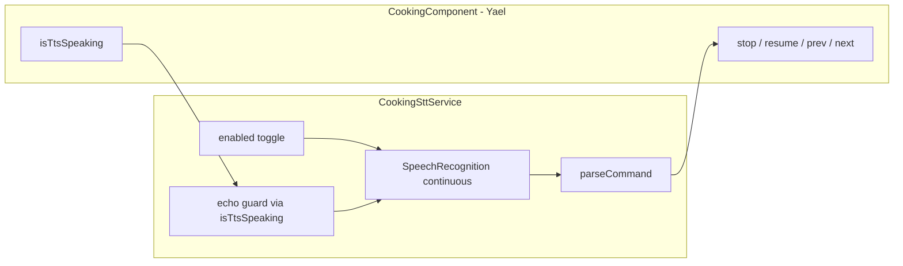

# משימה A — מצב בישול: `cooking-stt.service`

- **ענף Git:** `feature/cooking-voice-commands`
- **⏸️ ממתינה ל:** M11 (Yael — `cooking.component` + `cooking-tts.service` + טיימרים), יום 4 ~12:00
- **MERGE שלי:** M14, ~15:00
- **בעלות:** `features/cooking/cooking-stt.service.ts` בלבד. אני **לא** בעלת `cooking.component`.

> **הערת נתיב:** בתוכנית כתוב `features/cooking/cooking-stt.service.ts`, אבל שאר השירותים יושבים ב-`features/cooking/services/`. עדיף לשים את הקובץ ליד `cooking-tts.service.ts`.

---

## מה כבר מוכן מ-Yael (חוזה M11)

אין צורך לחכות כדי **לתכנן** — הקוד כבר חושף את מה שה-STT צריך לצרוך:

| מה | איפה ב-`cooking.component.ts` | שימוש ב-STT |
|----|------------------------------|-------------|
| דגל echo | `isTtsSpeaking` (= `tts.active`) | להשהות מיקרופון בזמן TTS |
| עצור | `stopSpeech()` | פקודה "עצור" / `stop` |
| המשך | `resumeSpeech()` | פקודה "המשך" / `continue` |
| קודם / הבא | `previous()` / `next()` | פקודות ניווט |
| ביטול countdown | `cancelAutoAdvance()` | לקרוא לפני `next()` כשיש auto-advance |

**מה עדיין חוסם MERGE:** חיבור בפועל ל-`cooking.component` (שלב 5) — רק אחרי ש-M11 ב-`develop`.

---

## שלב 0 — הכנה (לפני / מיד אחרי M11)

1. ענף: `feature/cooking-voice-commands` מ-`develop` **אחרי** merge של M11.
2. סנכרון קצר עם Yael: איך היא תחבר את ה-UI (מיקרופון + toggle) — את **לא** בעלת `cooking.component`, אבל ה-deliverable כולל אינדיקטור. הפתרון הנפוץ: השירות מחזיר signals (`supported`, `enabled`, `listening`, `pausedForEcho`) + `toggle()`, והיא מוסיפה 5–10 שורות HTML (או PR משותף באותו יום).
3. מפת פקודות (קבועה בשירות):

| פקודה | עברית | אנגלית | פעולה |
|-------|--------|--------|--------|
| stop | עצור | stop | `stopSpeech()` |
| continue | המשך | continue | `resumeSpeech()` |
| previous | קודם, הקודם | previous | `previous()` |
| next | הבא | next | `cancelAutoAdvance()` + `next()` |

---

## שלב 1 — שלד השירות + תמיכה בדפדפן

**קובץ:** `client/src/app/features/cooking/services/cooking-stt.service.ts`
**בדיקה:** השירות נוצר; `supported === false` כשאין `SpeechRecognition`.

- `@Injectable()` (כמו TTS — provider ברמת component).
- זיהוי API: `window.SpeechRecognition || window.webkitSpeechRecognition`.
- Signals readonly:
  - `supported`
  - `enabled` — המשתמש הפעיל/כיבה האזנה
  - `listening` — recognition רץ עכשיו
  - `pausedForEcho` — כיבוי זמני בגלל TTS
- `TranslateService` לבחירת `lang` (`he-IL` / `en-US`, כמו ב-TTS).

---

## שלב 2 — מנוע זיהוי פקודות

**בדיקה:** unit tests עם mock של `SpeechRecognition` (בסגנון `cooking-tts.service.spec.ts`).

- טיפוס: `CookingVoiceCommand = 'stop' | 'continue' | 'previous' | 'next'`.
- פונקציה `parseCommand(transcript: string): CookingVoiceCommand | null`:
  - נרמול: lowercase, trim, הסרת סימני punctuation.
  - התאמה: מילה שלמה או ביטוי קצר (למשל "הקודם" → previous).
- רשימת aliases בעברית **ובאנגלית** — לא להסתמך רק על מפתחות i18n (ה-STT מחזיר טקסט גולמי).

---

## שלב 3 — האזנה רציפה (Web Speech API)

**בדיקה:** mock — אחרי `onend` / `onresult` עם "הבא", recognition מופעל מחדש (continuous loop).

- `Recognition` עם:
  - `continuous: true`
  - `interimResults: false`
  - `lang` לפי שפת הממשק
- `start()` / `stop()` / `toggle()`.
- `onresult`: לקחת `results[results.length - 1][0].transcript`, לפרסר, ל-emit פקודה.
- `onend`: אם `enabled && !pausedForEcho` → `start()` שוב (Chrome עוצר אחרי שקט).
- `onerror`: לא לקרוס; `not-allowed` → `enabled = false`; שאר שגיאות → retry עם delay קצר.
- `ngOnDestroy` / `destroy()`: `abort()` + ניקוי handlers.

---

## שלב 4 — Echo guard (השהיית מיקרופון בזמן TTS)

**בדיקה:** כש-`isTtsActive()` עובר ל-`true` → `listening` false; כשחוזר ל-`false` וה-toggle דלוק → האזנה מתחדשת.

- מתודה `attach(options)` שמקבלת:
  - `isTtsActive: Signal<boolean>` (מ-`isTtsSpeaking`)
  - callbacks: `onStop`, `onContinue`, `onPrevious`, `onNext`
- `effect()` (או subscription) על `isTtsActive`:
  - `true` → `recognition.abort()`, `pausedForEcho = true`
  - `false` → `pausedForEcho = false`; אם `enabled` → `start()` אחרי ~300ms (buffer אחרי סיום TTS)
- כשמגיעה פקודה → קודם `cancelAutoAdvance()` (דרך callback) ואז הפעולה המתאימה.

---

## שלב 5 — חיבור פקודות ל-`cooking.component`

**בדיקה ידנית:** במצב בישול, כל 4 הפקודות עובדות בעברית ובאנגלית.

מיפוי ב-`attach`:

```typescript
onStop: () => host.stopSpeech(),
onContinue: () => host.resumeSpeech(),
onPrevious: () => host.previous(),
onNext: () => { host.cancelAutoAdvance(); host.next(); },
```

**שים לב:** בשלב מצרכים (`ingredients`) `previous()`/`next()` עלולים לא לעשות כלום — זה OK; STT רלוונטי בעיקר בשלב הוראות.

---

## שלב 6 — UI: toggle + אינדיקטור מיקרופון

**בעלות:** לפי התוכנית — השירות שלך; ה-HTML של Yael. לתאם:

**בשירות (שלך):**
- `toggle()`, `enabled()`, `listening()`, `pausedForEcho()`, `supported()`

**ב-component (Yael, או PR משותף):**
- כפתור toggle (🎤) — מוצג רק אם `stt.supported()`
- class ויזואלי: `--active`, `--paused-echo`, `--off`
- `providers: [..., CookingSttService]` + `ngOnInit` → `stt.attach({ isTtsActive: this.isTtsSpeaking, ... })`
- `ngOnDestroy` → `stt.destroy()`

**i18n** (מפתחות חדשים, למשל ב-M16):
- `COOKING.STT_TOGGLE`, `COOKING.STT_LISTENING`, `COOKING.STT_PAUSED_ECHO`, `COOKING.STT_UNSUPPORTED`

---

## שלב 7 — בדיקות + MERGE M14

1. **Unit:** `cooking-stt.service.spec.ts` — parse, echo pause/resume, restart on `onend`, dispatch callbacks.
2. **ידני ב-Chrome:** localhost, הרשאת מיקרופון, מתכון עם TTS, בדיקת echo (לא מזהה את הקול של ההקראה).
3. `npm run build` + `npm test`.
4. PR ל-`develop` → MERGE M14 ~15:00.

---

## מה אפשר להתחיל **עכשיו** (לפני M11)

| אפשר | לא אפשר עדיין |
|------|----------------|
| שלבים 1–4 + tests | חיבור ל-component (שלב 5–6) |
| `parseCommand` + mock tests | i18n סופי ב-HTML |
| עיצוב API של `attach()` | merge ל-develop |

אם M11 עדיין לא ב-`develop`, אפשר לפתוח את הענף מול `feature/step-timers` של Yael **רק לפיתוח**, ולפני PR לעשות rebase על `develop` אחרי M11.

---

## סיכום זרימה



---

> לפי הוראת העבודה בתוכנית: **אחרי כל שלב — בדיקה ואישור לפני שממשיכים לשלב הבא.**
