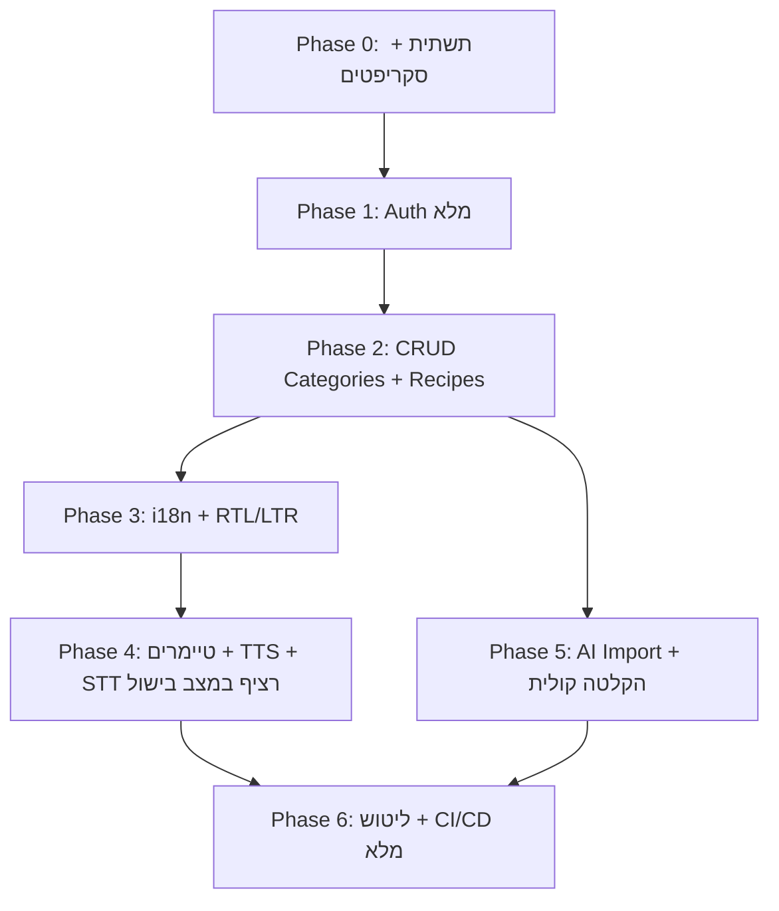

# תוכנית עבודה — פלטפורמת מתכונים עם עוזר מטבח קולי

מסמך זה הוא תוכנית עבודה בלבד. אין בו קוד, אין יצירת קבצים נוספים, ואין מימוש.

## 1. סקירת הפרויקט

פלטפורמה לניהול מתכונים (מאורגנים בקטגוריות היררכיות) עם עוזר מטבח קולי: המערכת מקריאה בקול את שלבי ההכנה (TTS) ובמקביל מאזינה ברציפות לפקודות קוליות (STT) לשליטה בהקראה — "עצור"/"המשך"/"קודם" (וכן "הבא"), וכן פקודות מקבילות באנגלית: stop/continue/previous/next — ומפעילה טיימרים לכל שלב, כדי שהמשתמש יוכל לשלוט בהקראה ובמעבר בין השלבים מבלי לגעת במסך בזמן הבישול.

### Stack טכנולוגי

- **Backend**: Node.js + Express 5 + Mongoose 9 + MongoDB (ES Modules, קובץ כניסה `server/app.js`)
- **Frontend**: Angular 21 (Standalone Components)
- **i18n**: ngx-translate — עברית (RTL) + אנגלית (LTR)
- **Auth**: JWT + bcrypt + Google OAuth
- **CI/CD**: GitHub Actions

### מצב קיים בריפו (נקודת התחלה)

- `server/app.js` — שרת Express בסיסי עם `cors`, `express.json`, חיבור DB (`config/db.js`) ו-route בודד `GET /`.
- `server/models/` — שלוש סכמות Mongoose מוכנות: `user`, `category`, `recipe` (refs באותיות קטנות).
- `client/` — פרויקט Angular 21 ריק: `app.routes.ts` ו-`app.config.ts` ללא תוכן ממשי.
- תלות חסרה בצד שרת: `jsonwebtoken`, `bcrypt`, `multer`, `passport`/Google OAuth, ספריות Voice ו-LLM. תלות חסרה בצד לקוח: `@ngx-translate/core`, `@ngx-translate/http-loader`.

---

## 2. מבנה תיקיות מומלץ

### Backend (`server/`) — דפוס MVC + Services

```text
server/
  app.js                      # כניסה: middleware, mount routers, error handler
  config/
    db.js                     # קיים
    passport.js               # אסטרטגיית Google OAuth
  models/                     # קיים: user / category / recipe
  controllers/                # שכבת בקרים דקה (req/res בלבד)
    auth.controller.js
    user.controller.js
    category.controller.js
    recipe.controller.js
    voice.controller.js       # 2 endpoints: חילוץ מתכון מהקלטה (AI Import) + זיהוי פקודה קצרה (מצב בישול)
    ai.controller.js
  services/                   # לוגיקה עסקית, מנותקת מ-Express
    auth.service.js
    category.service.js       # כולל לוגיקת היררכיית parentCategory
    recipe.service.js
    voice.service.js          # STT (Whisper) + TTS להקראת שלבי הכנה
    ai.service.js             # חילוץ JSON מ-PDF/תמונה/הקלטה קולית
  routes/
    index.js                  # aggregator: app.use('/api', router)
    auth.routes.js
    user.routes.js
    category.routes.js
    recipe.routes.js
    voice.routes.js
    ai.routes.js
  middleware/
    auth.middleware.js        # אימות JWT
    error.middleware.js       # error handler מרכזי
    upload.middleware.js      # multer ל-PDF/תמונה/אודיו
    validate.middleware.js    # ולידציה (express-validator / zod)
  utils/
    jwt.js
    recipeSchema.js           # סכמת היעד ל-Structured Output של ה-LLM
  uploads/                    # זמני, ב-.gitignore
  tests/                      # בדיקות (Jest / Vitest + supertest)
```

עקרונות: הבקרים דקים ומנתבים בלבד; כל לוגיקה עסקית ב-`services`; כל הראוטרים מתחברים דרך `routes/index.js` כדי לשמור על `app.js` נקי.

### Frontend (`client/src/app/`) — Standalone Components

```text
client/src/app/
  app.ts / app.config.ts / app.routes.ts   # רישום providers + lazy routes
  core/
    guards/        auth.guard.ts            # CanActivate מבוסס JWT
    interceptors/  jwt.interceptor.ts       # הזרקת Authorization header
                   error.interceptor.ts
    services/      auth.service.ts, recipe.service.ts, category.service.ts,
                   voice.service.ts, ai.service.ts
    models/        recipe.model.ts, category.model.ts, user.model.ts
  features/        # כל פיצ'ר עם lazy loaded routes משלו
    auth/          login / register / oauth-callback
    recipes/       list / detail / form
    cooking/       cooking-mode (הקראת שלבים ב-TTS + טיימרים ויזואליים + האזנה רציפה לפקודות STT)
    categories/    ניהול קטגוריות היררכי
    ai-import/     wizard: העלאת PDF/תמונה/הקלטה קולית חיה -> תצוגה מקדימה לעריכה -> שמירה
  shared/          components/ pipes/ directives/   # rtl.directive וכו'
  i18n/            (assets/i18n/he.json, en.json)
```

ב-Angular 21 העדיפו `loadComponent`/`loadChildren` ב-`app.routes.ts`, ורישום `provideHttpClient(withInterceptors([...]))` + `provideTranslate` ב-`app.config.ts` (לשמירה על קבצים נקיים).

---

## 3. Roadmap כרונולוגי (סדר שמונע תלויות חוסמות)



- **Phase 0 — תשתית**: התקנת תלות חסרה (server + client), `.env.example`, error handler מרכזי, `routes/index.js`, הקמת ngx-translate בסיסי, פעולת CI ראשונית (lint+build).
- **Phase 1 — Auth**: bcrypt + JWT, `auth.controller/service`, `auth.middleware`, Google OAuth (passport), בצד לקוח: `auth.service`, `jwt.interceptor`, `auth.guard`, מסכי login/register. *בסיס לכל מה שדורש `userId`.*
- **Phase 2 — CRUD**: Categories (כולל היררכיית `parentCategory` ובניית עץ) ואז Recipes (עם `instructions[].timer`). כל הנתיבים מוגנים ב-JWT ומסוננים לפי `userId`.
- **Phase 3 — i18n + RTL/LTR**: קבצי `he.json`/`en.json`, החלפת שפה דינמית, החלפת `dir`/`lang` על `<html>`, התאמות סגנון RTL.
- **Phase 4 — טיימרים + TTS + STT במצב בישול**: המערכת מקריאה בקול את שלבי ההכנה (TTS) ובמקביל המיקרופון מאזין ברציפות לפקודות שליטה בהקראה — "עצור"/"המשך"/"קודם" (וכן "הבא"), וכן stop/continue/previous/next באנגלית — עם אינדיקטור ויזואלי שהמיקרופון פעיל; כפתור toggle בולט להפעלה/כיבוי של ההאזנה. בנוסף, טיימרים ויזואליים לכל שלב עם `hasTimer: true`.
- **Phase 5 — AI Import (זרימה אג'נטית)**: wizard עם שלב העלאה בו שלוש אפשרויות — PDF, תמונה, ו**הקלטה קולית חיה** (המשתמש מכתיב את המתכון). PDF/תמונה/אודיו -> חילוץ טקסט (PDF parser / OCR / Whisper) -> LLM עם Structured Output לפי `recipeSchema` -> תצוגה מקדימה לעריכה -> שמירה ב-DB. כל טיפול האודיו הקולי מתבצע כאן כחלק מהזרימה האג'נטית. (תלוי רק ב-Phase 2.)
- **Phase 6 — ליטוש + CI/CD**: בדיקות, כיסוי, pipeline מלא (lint/build/test/deploy), תיעוד.

---

## 4. Git Flow

מודל: `main` (יציב/production) -> `develop` (אינטגרציה) -> ענפי פיצ'ר. מיזוג דרך Pull Request עם review ו-CI ירוק בלבד.

### שמות ענפים מומלצים

- `feature/backend-infra`
- `feature/auth-jwt-bcrypt`
- `feature/auth-google-oauth`
- `feature/categories-crud`
- `feature/recipes-crud`
- `feature/i18n-rtl`
- `feature/cooking-voice-commands`
- `feature/step-timers`
- `feature/ai-import`
- `feature/ci-cd`
- תיקונים: `fix/<תיאור>` · תחזוקה: `chore/<תיאור>`

### מתי למזג

- ענף פיצ'ר -> `develop` כאשר הפיצ'ר עצמאי ועובר CI.
- `develop` -> `main` בכל Milestone (גרסה מתויגת `vX.Y.Z`).
- מומלץ Squash merge לשמירה על היסטוריה נקייה; מחיקת ענף לאחר מיזוג.

### שמירה על `app.js` ו-`app.routes.ts` נקיים (מניעת קונפליקטים)

- **`server/app.js`**: לא להוסיף בו הגדרות routes ישירות. כל פיצ'ר מוסיף קובץ ב-`routes/` ונרשם רק ב-`routes/index.js` (`router.use('/recipes', recipeRoutes)`), בעוד `app.js` מבצע `app.use('/api', routes)` בלבד. כך כל פיצ'ר נוגע בקובץ ראוטר נפרד.
- **`client/src/app/app.routes.ts`**: כל פיצ'ר נטען עם `loadChildren` מקובץ routes פנימי שלו (למשל `features/recipes/recipes.routes.ts`); `app.routes.ts` מכיל רק שורת lazy אחת לכל פיצ'ר -> קונפליקטים מינימליים.
- העדיפו עריכות מבודדות פר-קובץ; הימנעו מעריכת קבצי כניסה משותפים בכמה ענפים במקביל.

---

## 5. Milestones + CI/CD

### Milestones

- **M1 — Foundation**: תשתית + Auth מלא (כולל Google OAuth) עובד מקצה לקצה.
- **M2 — Core Data**: CRUD מלא ל-Categories (היררכי) ו-Recipes + i18n/RTL.
- **M3 — Cooking Kitchen**: הקראת שלבים ב-TTS + האזנה רציפה לפקודות STT + טיימרים ויזואליים פעילים במצב בישול.
- **M4 — AI + Release**: AI Import (כולל הקלטה קולית חיה) עובד, CI/CD מלא, תיעוד וגרסה ל-`main`.

### CI/CD — GitHub Actions (`.github/workflows/`)

- **`ci.yml`** (טריגר: PR ל-`develop`/`main`):
  - **Lint**: ESLint (server) + `ng lint` (client).
  - **Build**: `npm ci` + `ng build` (client) ובדיקת import/syntax בצד שרת.
  - **Test**: בדיקות server (Jest/Vitest + supertest, עם mongodb-memory-server) + `ng test` ב-headless.
  - Matrix job ל-`server` ו-`client` בנפרד; cache ל-npm.
- **`deploy.yml`** (טריגר: push ל-`main`):
  - **Deploy**: build production, פריסת Frontend (למשל Netlify/Vercel/Static host) ו-Backend (למשל Render/Railway), הזרקת secrets (`MONGO_URI`, `JWT_SECRET`, מפתחות Google/LLM) דרך GitHub Secrets.
- שער איכות: מיזוג ל-`main` חסום עד שכל ה-checks ירוקים.

---

## 6. המלצות טכניות

### Voice — TTS + STT דו-לשוני

- **TTS להקראת שלבים (מצב בישול)**: הקראה בקול של שלבי ההכנה בעברית ובאנגלית. מומלץ Web Speech API (`speechSynthesis`) בדפדפן להקראה מיידית ללא עלות, עם אפשרות נפילה ל-TTS בצד שרת (למשל OpenAI TTS / Google Cloud TTS) לאיכות קול עקבית. בחירת קול ושפה לפי שפת הממשק הנוכחית.
- **STT לחילוץ מתכון (AI Import)**: OpenAI **Whisper** (`whisper-1`) בצד שרת — תמיכה רב-לשונית מצוינת כולל עברית; מקבל את ההקלטה הקולית החיה, מתמלל, וה-AI מחלץ ממנה מבנה מתכון מלא לפי `recipeSchema`.
- **STT לפקודות שליטה בהקראה (מצב בישול)**: זיהוי פקודה קצרה בלבד — "עצור"/"המשך"/"קודם"/"הבא", וכן stop/continue/previous/next. מומלץ Web Speech API בדפדפן להאזנה רציפה בזמן-אמת ללא עלות, עם נפילה ל-Whisper בשרת לאיכות עקבית בעברית. שילוב TTS+STT דורש ניהול מצב כדי למנוע מהמיקרופון לזהות את קול ההקראה (echo) — למשל השהיית ההאזנה בזמן הקראה פעילה.

### Google OAuth ב-Angular

- זרימת שרת מומלצת: Frontend מפנה ל-`/api/auth/google` -> passport-google-oauth20 בשרת -> callback מנפיק JWT -> redirect ל-`oauth-callback` בלקוח ששומר את הטוקן. נמנע מחשיפת client secret בצד לקוח.

### Structured Outputs (AI Import)

- שימוש ב-Structured Outputs / JSON Schema של ה-LLM כדי לאלץ פלט תואם בדיוק ל-`recipeSchema` (כותרת, רכיבים, `instructions[{text, timer{duration, hasTimer}}]`, prepTime וכו').
- צינור: `multer` קולט PDF/תמונה/אודיו -> חילוץ טקסט (PDF parser / OCR / Whisper לאודיו) -> LLM עם schema -> ולידציה -> תצוגה מקדימה לעריכת המשתמש -> שמירה.

### RTL/LTR דינמי

- ngx-translate למחרוזות; בעת החלפת שפה לעדכן `document.documentElement.dir` (`rtl`/`ltr`) ו-`lang`.
- סגנון לוגי (`margin-inline`, `padding-inline`, `text-align: start`) במקום `left/right` קשיח, לתמיכה אוטומטית בשני הכיוונים.

---

## הערות סיכום

- להוסיף תלות חסרות מוקדם (Phase 0) כדי למנוע חסימות.
- לשמור ולידציה ובדיקת בעלות (`userId`) בכל נתיב מוגן.
- לשמור סודות ב-`.env`/GitHub Secrets בלבד; לעולם לא בקוד.
